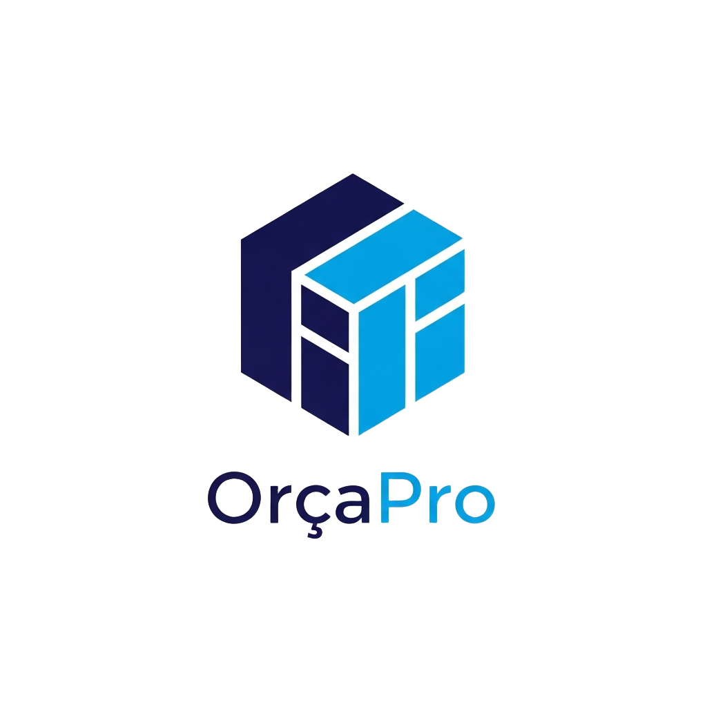

<p align="center">
  
</p>

<h1 align="center">OrçaPro</h1>

<p align="center">
  Bilingual construction quoting platform built for<br/>
  <strong>🇵🇹 Portugal</strong> and <strong>🇱🇺 Luxembourg</strong>
</p>

<p align="center">
  
  
  
  
  
  
</p>

<br/>

<p align="center">
  
</p>

<br/>

## The Problem

Construction companies in Portugal and Luxembourg still create quotes manually — copying spreadsheets, calculating totals by hand, sending unformatted PDFs. It's slow, error-prone, and unprofessional.

## The Solution

**OrçaPro** gives builders a fast, clean tool to create itemized construction quotes in minutes — with real-time calculations, a materials and labor catalog, reusable templates, and one-click PDF export. All bilingual (Portuguese / French), all responsive for mobile use on job sites.

---

## Features

| | Feature | Description |
|---|---|---|
| 📊 | **Dashboard** | Business overview — active quotes, pipeline value, conversion rate, revenue chart |
| 📝 | **Quotes** | Full lifecycle management: create, edit, duplicate, track status (Draft → Sent → Accepted / Rejected) |
| 📦 | **Materials** | Catalog with 11 categories, cost & sell prices, unit tracking (m², kg, L, ml) |
| 👷 | **Labor** | Dual-market pricing per trade — separate rates for Luxembourg and Portugal |
| 📄 | **Templates** | Pre-built and custom templates to speed up quote creation |
| 📤 | **PDF Export** | Professional branded PDFs with company logo, sections, totals, VAT breakdown |
| 🔢 | **Auto-calc** | Subtotals, discounts, VAT (IVA), and grand total — all computed in real-time |
| 🌍 | **PT / FR** | Full bilingual interface with instant language toggle |
| 📱 | **Mobile** | Responsive design with collapsible sidebar — works on any device |

---

## Tech Stack

```
Frontend    React 19 · Vite 7 · TailwindCSS 4 · shadcn/ui · Radix UI · Framer Motion
Backend     Node.js · Express 5 · TypeScript
Database    PostgreSQL · Drizzle ORM (in-memory fallback included)
State       React Context · TanStack Query
PDF         jsPDF · jspdf-autotable
Charts      Recharts
Routing     Wouter (client) · Express (server)
```

---

## Quick Start

> **Requirements:** Node.js ≥ 20 — PostgreSQL is optional (app runs in-memory by default)

```bash
git clone https://github.com/Hugomelo123/construcion.git
cd construcion
npm install
cp .env.example .env
npm run dev
```

Open **http://localhost:5000** and start quoting.

### Production

```bash
npm run build   # Vite (client) + esbuild (server)
npm start       # Serve the production build
```

### Environment

| Variable       | Description              | Default       |
| -------------- | ------------------------ | ------------- |
| `PORT`         | Server port              | `5000`        |
| `DATABASE_URL` | PostgreSQL connection    | —             |
| `NODE_ENV`     | `development` / `production` | `development` |

---

## Roadmap

- [ ] AI-powered quote generation from project descriptions
- [ ] Authentication & multi-company support
- [ ] Send quotes by email directly from the app
- [ ] Photo attachments for job site documentation
- [ ] Accounting software integration
- [ ] Dark mode

---

## Contributing

1. Fork the repo
2. Create your branch — `git checkout -b feature/my-feature`
3. Commit — `git commit -m 'Add my feature'`
4. Push — `git push origin feature/my-feature`
5. Open a PR

---

## License

[MIT](LICENSE)

<br/>

<p align="center">
  <sub>Built for builders. 🇵🇹 🇱🇺</sub>
</p>
